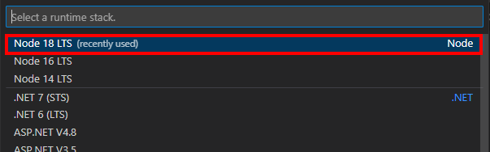

# Application Overview
This document provides a comprehensive guide to understanding, using, and deploying the dicyano web application built on Node.js version 18.14.2.

# Table of Contents
1. [Starting the Application](#starting-the-application)
    1. [Setting Up the Development Server](#setting-up-the-development-server)
    2. [Setting Up the Production Server](#setting-up-the-production-server)
2. [Understanding the Application Structure](#understanding-the-application-structure)
    1. [Source Code and Configuration Files](#source-code-and-configuration-files)
    2. [Environment Variables](#environment-variables)
    3. [Hidden Folders](#hidden-folders)
3. [How to Add a New Customer](#how-to-add-a-new-customer)
4. [Assign or Create Dashboards](#assign-or-create-dashboards)
5. [User Dashboard Configuration](#user-dashboard-configuration)
6. [How to Manually Deploy Local Changes](#how-to-manually-deploy-local-changes)
    1. [Initial Deployment](#initial-deployment)
    2. [Redeployment](#redeployment)
7. [Creating a New Environment](#creating-a-new-environment)
    1. [Registering a New Web App](#registering-a-new-web-app)
    2. [Setting up the Environment](#setting-up-the-environment)
    3. [Register the redirect uri of the login app](#register-the-redirect-uri-of-the-login-app)
8. [Refresh App Registrations](#refresh-app-registrations)

# Starting the Application
## Setting Up the Development Server
After obtaining the [latest version](https://github.com/AmoreAqua/DiCyano-Platform-setup/tree/ramboll-code) of the application by pulling the source code, open a terminal or command prompt and navigate to the application's root directory (That is the directory with the package.json file).

Run the following command to install any necessary dependencies:
```bash
npm install
```

To start the development server, execute the following command:
```bash
npm run dev
```

Access the web application via your browser by navigating to http://localhost:5300.

## Setting Up the Production Server
Run the following commands in sequence to build and serve the production version of the application:

```bash
npm run build
npm run serve
```

Access the web application via your browser by navigating to http://localhost:3000.

The available commands can be found in the package.json file under the "scripts" section. Additionally, the installed node modules and their respective versions are also listed in this file.

# Understanding the Application Structure
## Source Code and Configuration Files
The application's source code is located in the src/ folder. Configuration files can be found in the src/config/ directory, which contains several important files:


## Environment Variables
General environment variables are stored in `src/config/.env`. These variables are loaded regardless of the Node.js environment (`NODE_ENV`). Specific environment variables for development and production environments are stored in `.env.development` and `.env.production` files, respectively.

The structure of a .env file consists of key-value pairs, where each pair is separated by an equal sign (=) and a newline character. Here's an example of a basic .env file structure:

```ini
LOGIN_APP_CLIENT_ID="bb06acc4-2754-47d9-9190-61fa2994efb5"
LOGIN_APP_TENANT_ID="e4fc4d4e-325d-4b2c-bf97-b655a50db662"
LOGIN_APP_CLIENT_SECRET="QagRD_j2THm_e.UW??w8A/~D'~JK>a/Q]6'&](QE4v>{"
```

Because .env files contain sensitive information and environment specific configurations, **they are not included in the git version control and need to be added seperately**.


## Hidden Folders
The dist folder contains distribution or deployment files, which are automatically generated and should not be modified. Its contents will be overwritten with each new build.

The node_modules folder is used by the Node.js ecosystem to store packages and should not be modified.

# How to Add a New Customer
To add a new customer, follow these steps:

Access the Azure portal by visiting portal.azure.com.
Log in using an administrator account for the CMT KONSULT organization.
Navigate to "Azure Active Directory" followed by "Users," and then add the user as needed.


# Assign or Create Dashboards
The Web App allows users to access various dashboards based on the groups they are assigned to. A group represents a customer, and all users for that customer should be assigned to the same group. A user assigned to multiple groups can access dashboards from all of those groups.

To assign or create dashboards, follow these steps:

Access the Azure portal by visiting portal.azure.com.
Log in using an administrator account for the CMT KONSULT organization.
Navigate to "Azure Active Directory" followed by "Groups," and then add the user as needed. The Group type should be of type Security.

Refer to the [User Dashboard Configuration section](#user-dashboard-configuration) for information on modifying the dashboard for a group of users.


<details>
  <summary> Troubleshooting</summary>

If you encounter issues, ensure the following:

## Check that

1. The customer is assigned the correct group.
2. The Group ID exists in the reports folder as `src/config/reports/<group_id>.json.`
3. The JSON file is correctly formatted. If you open the server logs, the server will issue a warning if the JSON file for the user cannot be read while the user is loading the dashboard.
</details>


# User Dashboard Configuration
The application provides users with access to various dashboards based on their assigned user groups. These dashboard configurations are stored in `src/config/reports/<group_id>.json`, where `<group_id> `represents the unique identifier for each group of users, the group_id can be found by
logging in on portal.azure.com using an administrator account for the CMT KONSULT organization.
Navigate to "Azure Active Directory" followed by "Groups,"


The JSON file consists of one object containing two nested objects. The outer keys represent report group names, while the inner keys correspond to the display names of the reports. The inner values represent the unique identifiers (UUIDs) of the reports. An example structure is shown below:

```json
{
    "Report Group Title": {
        "MyReportName": "250927f5-8ba1-4ba6-9798-95451aa531fc",
        "Another Report Name": "b134b29b-382e-4f76-86a4-59edeaf383aa",
        "Coolest Report Name": "5406c2a4-80cf-4cc6-bcc2-963c546a0ad9"
    },
    "Another Title for Group of Reports": {
        "Report Name": "c35c001d-75c7-436a-8d90-26187a9dd49b"
    }
}
```


# How to Manually Deploy Local Changes
## Initial Deployment
Install the "Azure App Service" extension for Visual Studio Code.
In the left-side window, click the Azure icon.
Click "Sign in to Azure Account."


A new tab will open, where you can sign in using an administrator account for the "dicyano-production" project. Next, follow the [Redeployment section](#redeployment) below.

<details>
<summary>Troubleshooting</summary>
Troubleshooting
In the Azure window, select your resource by navigating to "Azure subscription 1" -> "App Services" -> "dicyano-production." If you cannot see this, your account may not have the required permissions.


</details>


## Redeployment

To redeploy the Web App, first make sure that the build files are up to date, by running the following command in a terminal or command prompt from the application's root directory:
```bash
npm run build
```

After building follow either Quick Redeployment to production or general redeployment depending on if you want to redeploy to the production environment or to any other environment.

<details>
<summary>Quick Redeployment to production</summary>

---

Press Ctrl+Shift+P to open the Visual Studio Code Command Palette, then type and select the option "Azure App Service: Deploy to Web App..." Press Enter.


---
</details>

<details>
<summary>General Redeployment</summary>

---
In the window on the left, select the Azure icon. Choose Azure subscription 1 as the resource. Right-click on the Web App that you want to deploy to, in this case `dicyano-staging`, and select `Deploy to Web App...`


---
</details><br>

In the popup window, choose "Deploy." This will overwrite any existing configuration on the server.


Wait for the deployment to finish. You can then visit `https://<web-app-name>.azurewebsites.net` (or any other website linking to the Azure app) to see your changes. For the dicyano-production Web App the link will be https://dicyano-production.azurewebsites.net.


<details>
<summary>Troubleshooting</summary>

The deployment can fail for several reasons. Check that
1. The files arent open in another program.

In general it is always a good idea to check the output-window for the deploy-command.


</details>

# Creating a New Environment
The code in this repository is designed to be hosted as a Web App on Azure App Services. This service can be utilized for setting up a testing environment or creating multiple production environments.

## Registering a New Web App

To create an App Service, ensure that the [Initial Deployment section](#initial-deployment). has been followed.

Afterward, press Ctrl+Shift+P to open the Visual Studio Code Command Palette. Type and select the option "Create New Web App... (Advanced)" and press Enter.


A new command palette window will open. Select "Azure subscription 1".


Enter a globally unique name for the new App, ensuring it is unique across all of Azure's apps. In this example, the name dicyano-staging was chosen for creating a staging environment.


Select DiCyano as the resource group.


For the runtime, choose the one that the Node.js application is built for. As of writing, the Node.js version is 18.14.2. Thus, `Node 18 LTS` should be selected.



Select the operating system for the webserver. Although only Windows has been tested, it should be possible to run the app on Linux as well.


Create an App Service plan. It is recommended to create a new App Service plan.


Press enter to assign the same name to the App Service plan as the web app.


For non-production environments, the `Free (F1)` pricing tier is recommended.


Skip the Application Insights resource.


## Setting up the Environment

It is time to set up the environment variables for the web app. Creating a new node environment is recommended. See `src/config/.env.<node-env>`. This ensures that the app can run with a specific configuration for this environment. Current examples include `.env.development`, `.env.production`, and `.env.stage`.

In the left-side window, click the Azure icon. Select Azure subscription 1 as the resource. Select the new Web App, in this case, `dicyano-staging`. Right-click the `Application Settings` and press `Add New setting`.

<details>

---
  <summary> Troubleshooting</summary>
During the time of writing, there were some issues with the App Service not displaying the settings correctly. If the window does not look like the one shown in the picture, press the reload button to refresh the resources.


---

</details>


A new command Palette window will open. Enter the name of the "Setting", in this case, `NODE_ENV`. Press enter and enter the value, in this case, `staging`.


Also, add the setting `SCM_DO_BUILD_DURING_DEPLOYMENT` and set it to `true`.

The web app is now correctly set up, and it is time to deploy the code of this repository to the server.

To ensure that the build files are current, execute the following command within a terminal or command prompt, originating from the application's root directory:

```bash
npm run build
```

In the window on the left, select the Azure icon. Choose Azure subscription 1 as the resource. Right-click on the new Web App, in this case `dicyano-staging`, and select `Deploy to Web App...`


In the ensuing popup window, select "Deploy." Be aware that this action will replace any preexisting configuration on the server.


Allow the deployment process to complete. Afterward, visit https://dicyano-staging.azurewebsites.net (or any other website linking to the Azure app) to view the updated content.

The web app is now operational on the new domain. However, it relies on a login app for user authentication. It is necessary to [register the new domain as a valid redirect](#register-the-redirect-uri-of-the-login-app) for the login app.

## Register the redirect uri of the login app

To register the new redirect uri as a valid uri, navigate to portal.azure.com using an administrator account for the CMT KONSULT organization. Proceed to "Azure Active Directory", followed by "App registrations." Select the application "DicyanoNorrvattenWebApp."


Click on the Authentication tab.


Within the Web window, add the new redirect uri as specified by the field REDIRECT_URI in the relevant `.env.<environment>` file. In this instance, it is `.env.staging`. Do not forget to save the changes.


The new Web App should now be functional.

## Refresh app registrations
To keep the app running after a long time, it is recommended to refesh the app credentials anually. To do so navigate to portal.azure.com using an administrator account for the CMT KONSULT organization. Proceed to "Azure Active Directory", followed by "App registrations." 

Do the following for "DiCyano_Powerbi" and "DicyanoNorrvattenWebApp":
Click on the respective application.


Select Certificates & Secrets.


Select the tab "Client secrets". Then find the corresponding tokens in the general environment variables stored in `src/config/.env`.
Delete the old secret, by pressing the blue-bin button. Then press "New client secret" to create a new secret. The generated secret should then be replaced in the .env file. Then rebuild the app.
